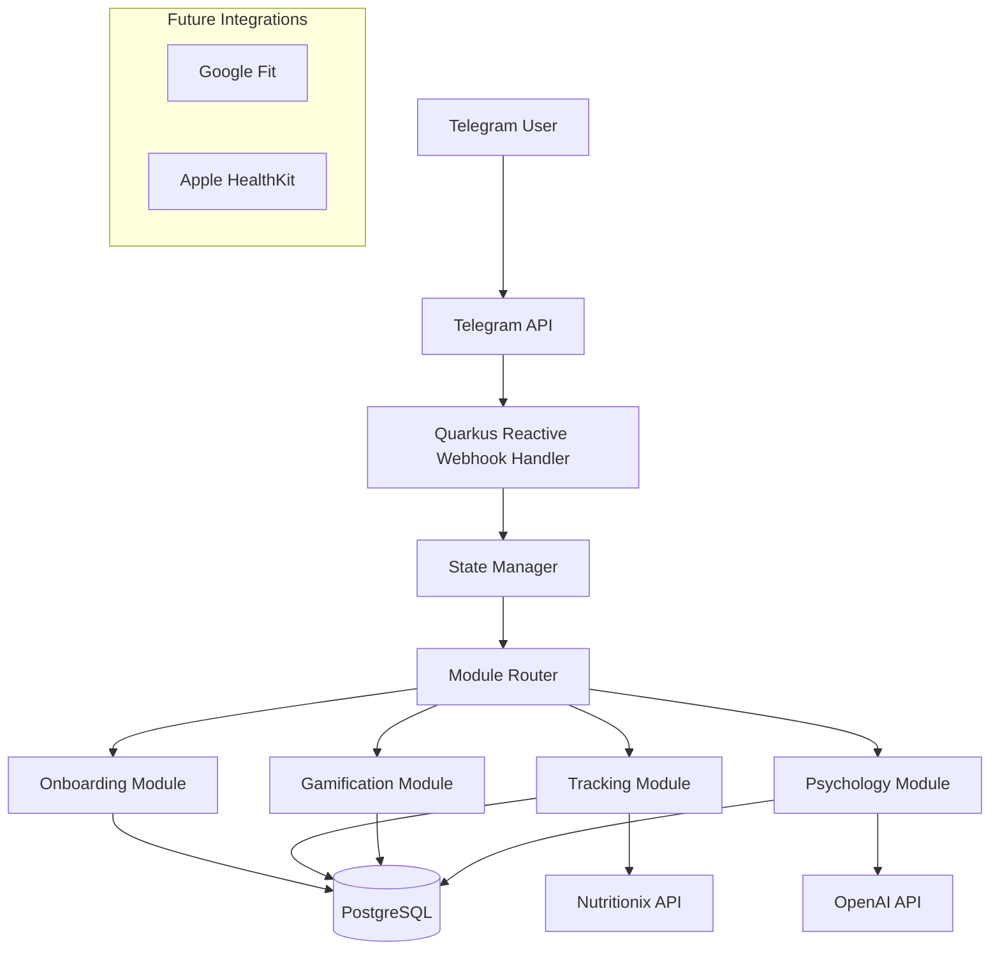

# Product Context

This file provides a high-level overview of the project and the expected product that will be created. Initially it is based upon projectBrief.md (if provided) and all other available project-related information in the working directory. This file is intended to be updated as the project evolves, and should be used to inform all other modes of the project's goals and context.
2025-09-04 02:05:18 - Log of updates made will be appended as footnotes to the end of this file.

*

## Project Goal

All-in-one ecosystem combining personalized nutrition, gamification, and psychological support in a Telegram bot. "Your personal nutritionist + psychologist + motivator in one place"

## Key Features

### MVP Features (Phase 1)
1. User onboarding with comprehensive questionnaire
2. Basic food tracking with manual entry
3. Calorie/nutrient calculation
4. Dual communication styles ("Mentor" & "Buddy")
5. Simple challenges system
6. Pre-defined psychological tips database

### Phase 2 Features
1. Photo-based food recognition
2. AI-generated personalized responses (OpenAI integration)
3. Fitness tracker integrations (Google Fit/Apple Health)
4. Community features
5. Premium subscription model

## Overall Architecture

[2025-09-04 02:06:45] - Initial population with project goal, key features, and architecture from projectBrief.md