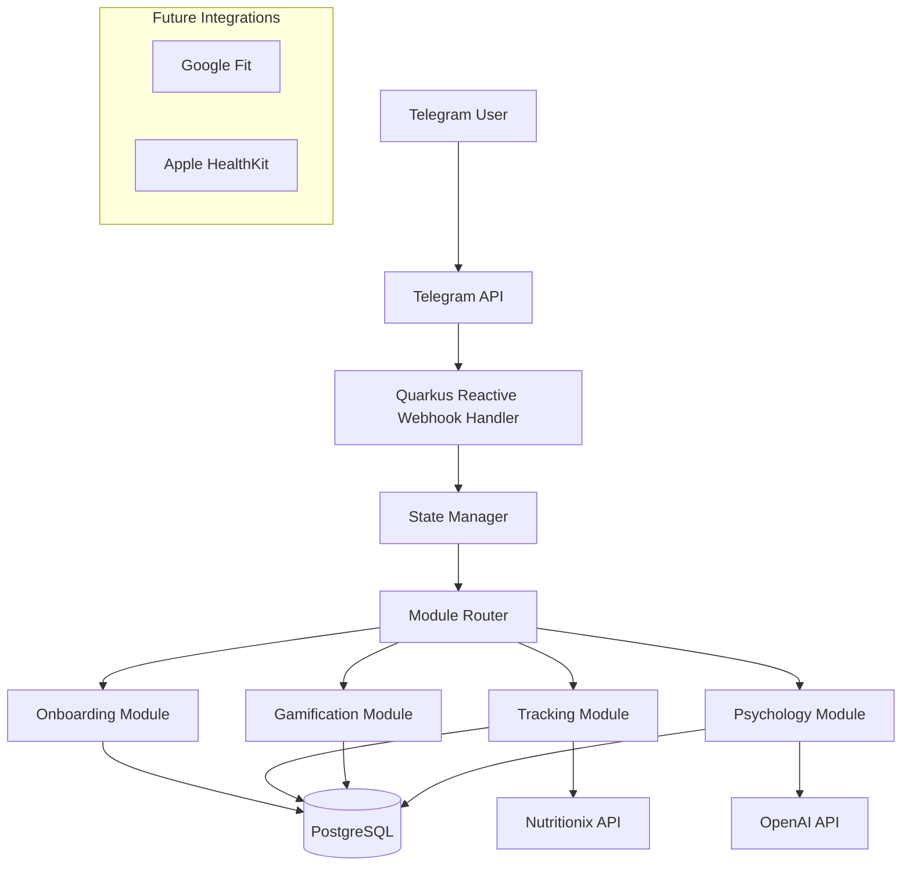

# Project Brief: NutriMind Telegram Bot

## 1. Project Overview
**Project Name:** NutriMind  
**Vision:** All-in-one ecosystem combining personalized nutrition, gamification, and psychological support in a Telegram bot  
**Core Concept:** "Your personal nutritionist + psychologist + motivator in one place"

## 2. Technology Stack

### Backend
- **Framework:** Quarkus (Java 21+)
- **Build Tool:** Maven
- **Reactive Programming:** Mutiny
- **API Style:** Reactive REST

### Database
- **Primary DB:** PostgreSQL (v14+)
- **Caching:** Redis (for tips and frequent queries)
- **Migrations:** Flyway

### External Integrations
- **Telegram:** Telegram Bot API
- **Nutrition Data:** Nutritionix API (or alternative)
- **AI/ML:** OpenAI GPT API (Future phase)

### Deployment & Infrastructure
- **Containerization:** Docker
- **Orchestration:** Kubernetes (future)
- **Cloud Provider:** AWS/DigitalOcean (TBD)
- **CI/CD:** GitHub Actions/GitLab CI

## 3. Key Features

### MVP Features (Phase 1)
1. User onboarding with comprehensive questionnaire
2. Basic food tracking with manual entry
3. Calorie/nutrient calculation
4. Dual communication styles ("Mentor" & "Buddy")
5. Simple challenges system
6. Pre-defined psychological tips database

### Phase 2 Features
1. Photo-based food recognition
2. AI-generated personalized responses (OpenAI integration)
3. Fitness tracker integrations (Google Fit/Apple Health)
4. Community features
5. Premium subscription model

## 4. High-Level Architecture



## 5. Database Schema Highlights

### Core Tables
- `users` - User profiles and preferences
- `user_goals` - Nutrition and fitness targets
- `food_entries` - Logged food consumption
- `challenges` - Available challenges
- `user_challenges` - User progress on challenges
- `psychological_tips` - Pre-defined tips and advice

## 6. Coding Standards

### Java Conventions
- Follow Java Code Conventions
- Use meaningful names (no abbreviations)
- Package naming: `com.nutrimind.[module].[component]`

### Reactive Programming
- Prefer Mutiny's `Uni` and `Multi` over CompletableFuture
- Avoid blocking operations in reactive pipelines
- Proper error handling in reactive chains

### Testing
- 80%+ test coverage goal
- Use QuarkusTest for integration tests
- Mock external dependencies
- Test reactive pipelines properly

### Documentation
- Javadoc for all public methods
- README files for each module
- API documentation using OpenAPI (Swagger)

## 7. Project Structure

```
src/
├── main/
│   ├── java/com/nutrimind/
│   │   ├── bot/                 # Telegram bot core
│   │   ├── onboarding/          # User registration flow
│   │   ├── tracking/            # Food tracking logic
│   │   ├── gamification/        # Challenges and rewards
│   │   ├── psychology/          # Psychological support features
│   │   ├── integrations/        # External API clients
│   │   └── common/              # Shared utilities
│   └── resources/
│       ├── application.yml      # Main configuration
│       ├── import.sql           # Initial data
│       └── tips/                # Psychological tips templates
├── test/
└── docker/                      # Docker configurations
```

## 8. Development Workflow

1. **Branching Strategy:** GitFlow
2. **Code Review:** Required for all merges to develop/main
3. **Commit Messages:** Conventional Commits standard
4. **Build Process:** Maven with Quarkus extensions

## 9. Environment Setup

### Prerequisites
- Java 21+
- Docker & Docker Compose
- Maven 3.8+
- Telegram Bot Token

### Local Development
1. Clone repository
2. Run `docker-compose up -d` for DB and Redis
3. Set `TELEGRAM_BOT_TOKEN` environment variable
4. Execute `mvn quarkus:dev`

## 10. Important Links

- **Project Board:** [Link to Jira/Trello]
- **API Documentation:** [Swagger UI URL]
- **CI/CD Pipeline:** [GitHub Actions URL]
- **Monitoring:** [Grafana Dashboard URL]
- **Error Tracking:** [Sentry URL]

## 11. Phase 1 Milestones

1. **Week 1-2:** Basic bot skeleton with webhook handling
2. **Week 3-4:** User onboarding and database setup
3. **Week 5-6:** Food tracking and basic nutrition calculations
4. **Week 7-8:** Dual communication style implementation
5. **Week 9-10:** Challenges system and psychological tips
6. **Week 11-12:** Testing, deployment, and MVP release

## 12. Risk Management

- **Telegram API Limitations:** Rate limiting and message size constraints
- **Nutrition Data Accuracy:** Quality of external API data
- **User Engagement:** Maintaining active usage beyond initial novelty
- **Data Privacy:** Strict compliance with GDPR for health data

This brief will be updated as the project evolves. Refer to the internal wiki for detailed specifications and API documentation.